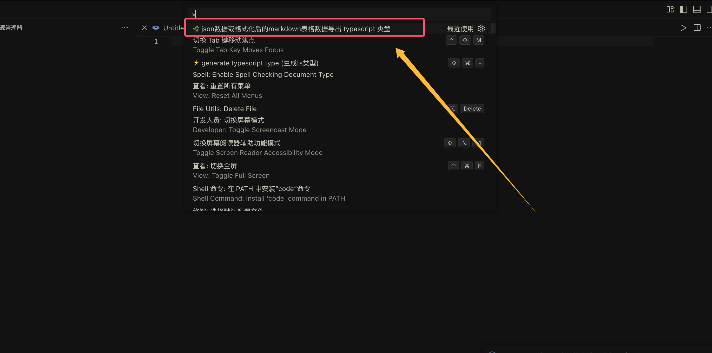
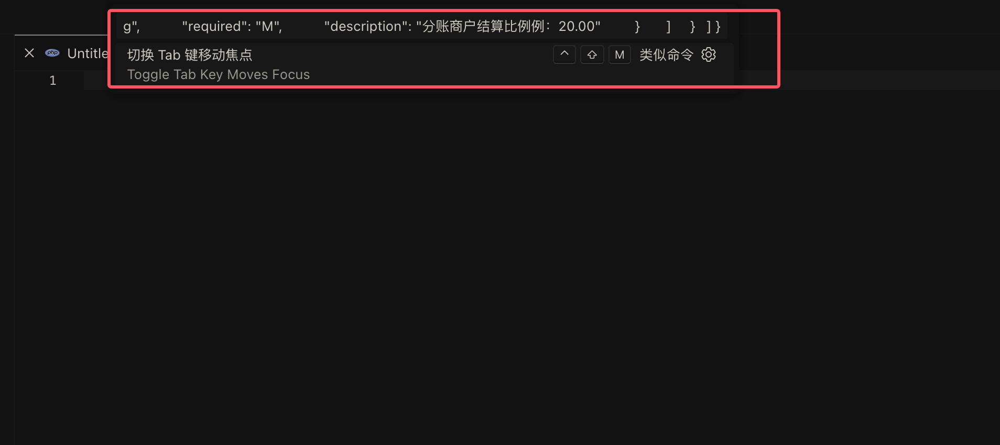
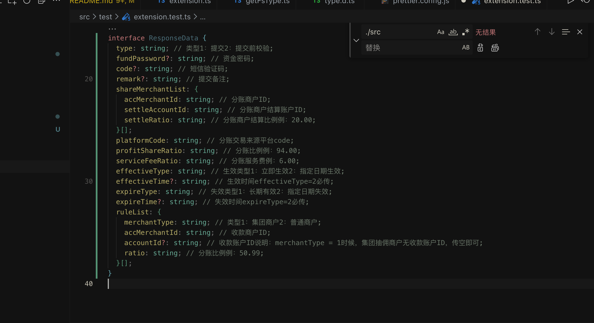
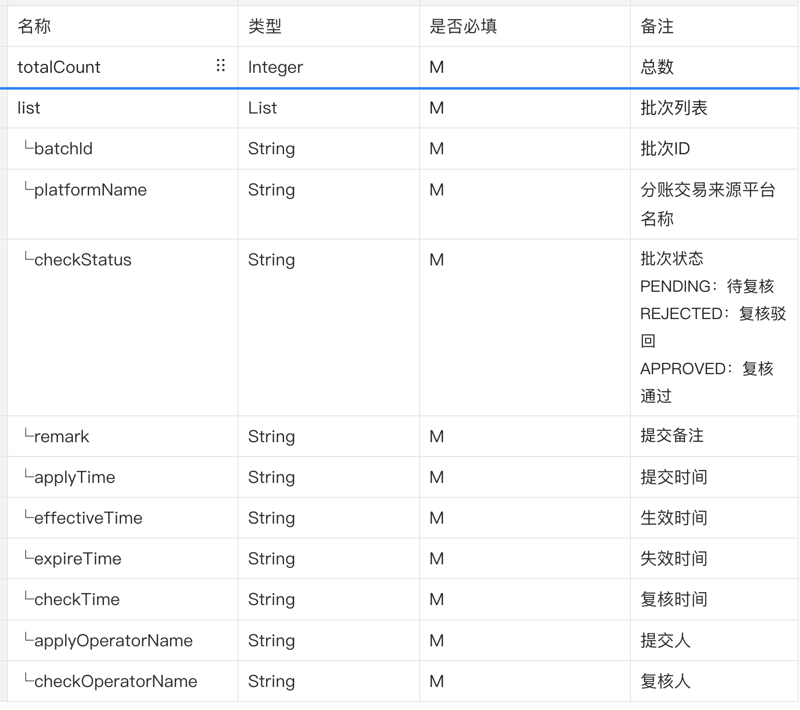
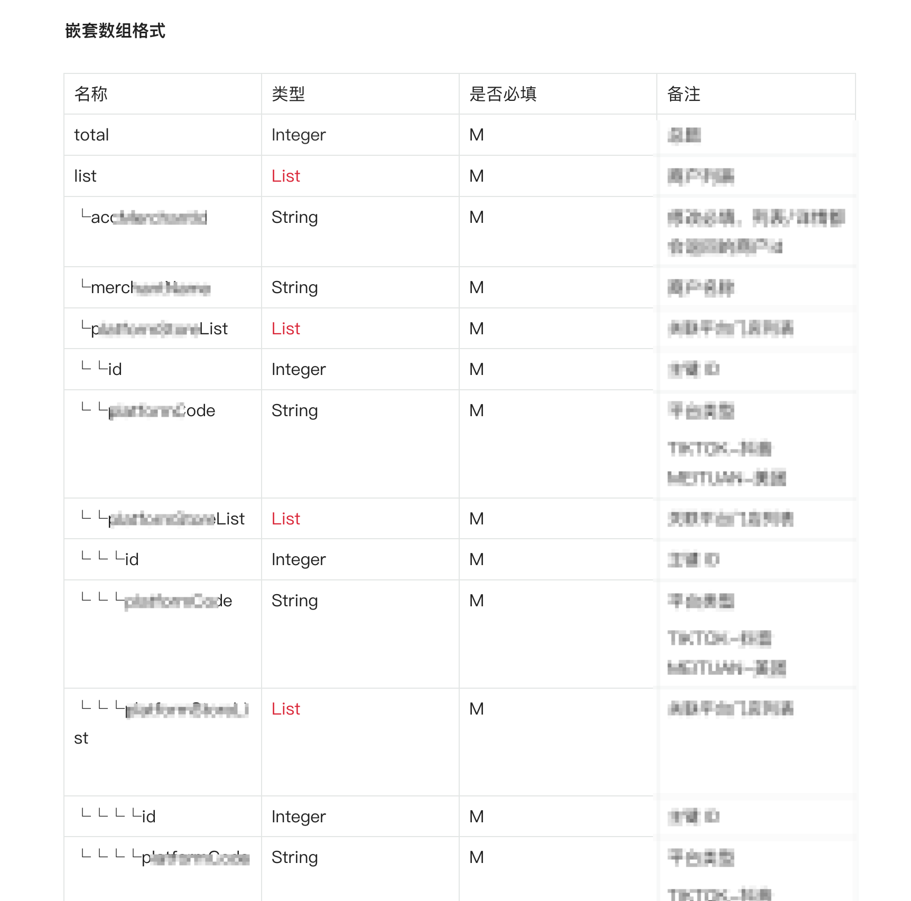
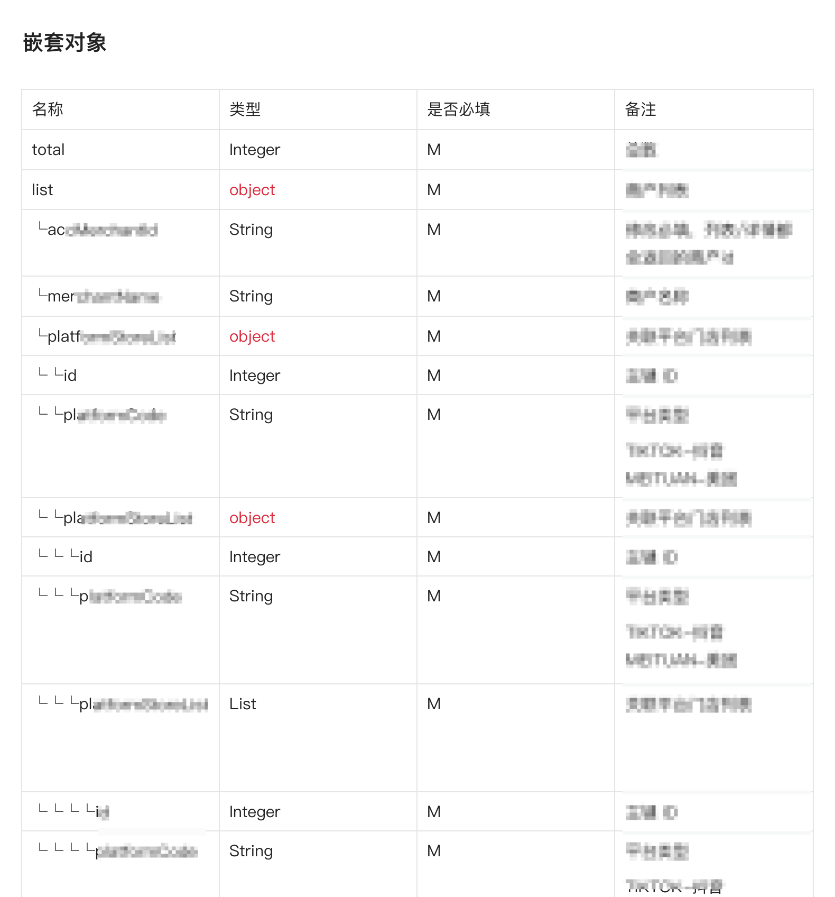

# 🌈 **transtype**: 你的VSCode TypeScript类型生成器

**VSCode插件**，能够将json数据或经过**谷歌浏览器插件Atom Honeycomb**格式化后的markdown表格数据转换成TypeScript类型定义。从而提升开发效率，让代码库更加规范和易于维护。

[谷歌浏览器插件点击直达](https://chromewebstore.google.com/search/Atom%20Honeycomb?hl=zh-CN&utm_source=ext_sidebar)

## 📸 **示例演示**

- 通过浏览器插件**Atom Honeycomb**将语雀表格数据格式化后，使用**transtype**插件生成TypeScript类型。

### 📦 **安装** 

### 安装方法

- 打开VSCode，进入插件商店。
- 在搜索框中输入“transtype”。
- 找到由LinHanPro提供的该插件，点击安装按钮，即可完成安装。

### 🔧 **使用指南（轻松三步走）**

#### 第1步：启动插件

- 按下 **F1** 键，召唤出VSCode的控制台。
- 输入 **"transtype"**，选择那个带有🌿图标的选项。
- 点击该选项，启动TypeScript类型生成的功能。

#### 第2步：输入数据

- 在弹出的输入框中，输入你准备好的json数据，或者已经通过Atom Honeycomb格式化好的markdown表格数据。这些数据就是用于生成TypeScript类型的“原料”。

#### 第3步：生成类型

- 输入完成后，按下回车键。
- 插件会自动将输入的数据转换为对应的TypeScript接口定义，并将其展示在编辑器中。

---

**两种方式详解：**

1. **直接使用JSON数据：**
   - 你可以将从浏览器控制台、apiFox、postman等工具中获取的接口返回值，以JSON格式复制粘贴到“transtype”插件的输入框中。
   - 插件会自动解析JSON数据，并生成相应的TypeScript接口。

2. **使用Atom Honeycomb格式化Markdown表格：**
   - 首先要确保已安装谷歌浏览器插件Atom Honeycomb。
   - 在语雀或其他支持Markdown的编辑器中编辑好表格数据。
   - 利用Atom Honeycomb插件将Markdown表格数据格式化为JSON格式。
   - 将格式化得到的JSON数据复制粘贴到VSCode的“transtype”插件输入框中。
   - 插件会将该JSON数据转换为TypeScript接口。

### 🌈 对于后端接口语雀文档表格定义字段的要求

为了使“transtype”插件能够更准确地生成TypeScript类型，对于后端接口语雀文档中的表格定义字段有以下要求：

以下为最佳示例

#### 对于嵌套数组

#### 对于嵌套对象

##### 具体表现为

● 表格结构

- 表格应包含四项内容：名称、类型、是否必填、字段描述。
  
##### 下列是对四个表头的具体描述/要求

● 名称

- 字段名称
- 驼峰法命名
- 如果该项为数组的某一项，则该名称以└ 开头，直至该组数组的所有项穷举完毕

● 类型标记映射

- 字符类型 --- 【String、string】
- 数字类型 --- 【Number、number、Int、int、Integer、integer】
- 布尔类型 --- 【Boolean、boolean】
- 数组类型 --- 【List、list、Array、array】

● 是否必填

- 必填 --- 【M、是、必填】
- 非必填 --- 【O、否、非必填】

● 字段描述

- 没有特别严格的要求，正常对字段进行描述即可。

---

### 🍭 **反馈与建议**

- 如果你在使用“transtype”插件过程中有任何想法、建议，或者发现了更好的使用方法，可以通过以下链接进入GitHub的issues页面进行留言：
[点这里留言](https://github.com/LinHanlove/transtype/issues/new)
这样，开发者可以看到你的反馈，不断优化插件，使其功能更加强大和完善。